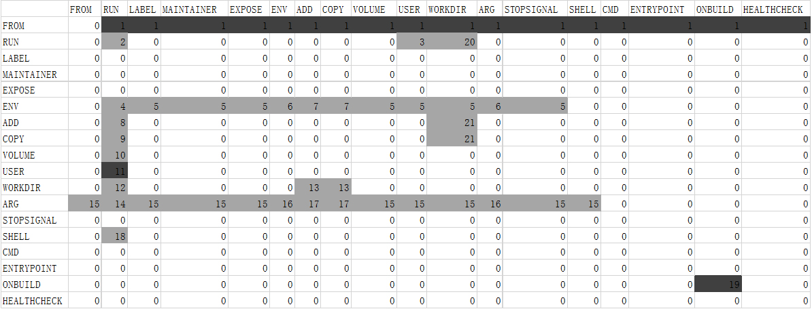

# dependency 模块

<p style="text-indent: 2em;">经过数据处理模块后，每个指令行会得到一个对应的指令特征结构，dependency模块通过自定义的依赖表格和依赖规则，对指令特征结构进行相关性判断，以此衡量指令间的依赖关系，从而实现依赖关系判断。</p>

## 依赖关系

<p style="text-indent: 2em;">定义: 即不可交换的偏序关系，交换后会导致原镜像构建失败。</p>

### 依赖关系分类

1. 功能性依赖关系(默认)

<p style="text-indent: 2em;">即后一条指令行依赖于前一条指令行的功能，两者不可交换。</p>

RUN(前) 和 RUN(后)

```
RUN apt install -y wget
RUN wget http://ftp.gnu.org/gnu/gawk/gawk-5.1.0.tar.xz
```

RUN(前) 和 WORKDIR(后)

```
RUN mkdir -p /app/test
WORKDIR /app/test
```

COPY(前)和RUN(后)

```
COPY ./gawk-5.1.0.tar.xz /usr/local/src/
RUN tar -xvf /usr/local/src/gawk-5.1.0.tar.xz -C /usr/local/src/
```

2. 一致性依赖(consistency dependency)关系

<p style="text-indent: 2em;">除了满足功能性依赖关系外，还要求构建前后镜像完全一致，即镜像环境变量，启动命令和启动参数以及每个文件所在路径等均不可发生改变。</p>

RUN(前) 和 WORKDIR(后)

```
WORKDIR /
RUN echo "123">./1.txt
WORKDIR /app
```

这里RUN指令与第两条WORKDIR指令之间存在一致性依赖关系，两者顺序不可交换，因为交换后会导致1.txt文件所在目录发生更改。在这种情况下，虽然可能并不会影响镜像的构建。

COPY(前) 和 WORKDIR(后)

```
WORKDIR /
COPY . .
WORKDIR /app
```

同理，COPY指令与第两条WORKDIR指令之间存在一致性依赖关系，两者顺序不可交换，因为交换后会导致文件所在目录发生更改。

## 依赖表格



<p style="text-indent: 2em;">表格中行名对应前一个指令名，而列名对应后一个指令名，表格中的数字代表依赖类型。如0代表无依赖，而1代表基础镜像依赖，需要强调的是，在这里认为除FROM指令外的所有指令都依赖于基础镜像即FROM指令。</p>

<p style="text-indent: 2em;">此外，表格中白色和深黑色部分为确定性依赖，白色(即数字0)表示无依赖，深黑色(如数字1)
表示有依赖，而灰色部分表示不确定依赖，即不确定是否依赖，因此需要根据特征向量中的字段进行判断。 例如9号类型依赖，即COPY在前RUN在后形式下的依赖性。</p>

### 顺序无关指令

<p style="text-indent: 2em;">包括CMD、ENTRYPOINT、ONBUILD、HEALTHCHECK。</p>

<p style="text-indent: 2em;">顺序无关指令作用于容器，而不是镜像，只在容器运行时起作用，在镜像状态时只是相当于一条配置信息，记录于配置文件中，因此，除基础镜像依赖(
即类型1)，顺序无关指令与任何指令都不存在依赖关系。ONBUILD与ONBUILD自身例外，因为在一个阶段中允许存在多个ONBUILD指令，而另外三个顺序无关指令，<a href="https://docs.docker.com/reference/dockerfile/#cmd">出现多次时，只有最后一个生效。</a></p>

<p style="text-indent: 2em;">出现多个USER或WORKDIR指令时，如果存在顺序无关指令，要求最后一个USER指令位置不能发生变化，否则会导致CMD、ENTRYPOINT等指令执行失败，因此，这种情况下，所有非最后一个USER/WORKDIR指令与最后一个USER/WORKDIR指令之间存在依赖关系。</p>

```
形式一
RUN wget http://example.com/test.sh
CMD ["sh", "-c", "./test.sh"]

形式二
CMD ["sh", "-c", "./test.sh"]
RUN wget http://example.com/test.sh

两种形式都不影响镜像构建与使用。
```

### 依赖关系汇总

| 类型  | 依赖规则              | 依赖数量(默认情况) |
|-----|-------------------|------------|
| 0   | 无依赖               | 1          |
| 1   | 基础镜像依赖            | 1          |
| 2   | RUN-RUN依赖         | 6          |
| 3   | RUN-USER依赖        | 2          |
| 4   | ENV-RUN依赖         | 2          |
| 5   | ENV-Tuple依赖       | 1          |
| 6   | ENV-DICT依赖        | 1          |
| 7   | ENV-DIR依赖         | 1          |
| 8   | ADD-RUN依赖         | 1          |
| 9   | COPY-RUN依赖        | 1          |
| 10  | VOLUME-RUN依赖      | 1          |
| 11  | USER依赖            | 1          |
| 12  | WORKDIR-RUN依赖     | 1          |
| 13  | WORKDIR-Dir依赖     | 1          |
| 14  | ARG-RUN依赖         | 2          |
| 15  | ARG-Tuple依赖       | 1          |
| 16  | ARG-DICT依赖        | 1          |
| 17  | ARG-DIR依赖         | 1          |
| 18  | SHELL-RUN依赖       | 1          |
| 19  | ONBUILD依赖         | 1          |
| 20  | RUN-WORKDIR依赖     | 1          |
| 21  | DIR-WORKDIR依赖     | 1          |
| 22  | USER-USER依赖       | 1          |
| 23  | WORKDIR-WORKDIR依赖 | 1          |

<p style="text-indent: 2em;">由于指令特征结构的Operand字段中的value字段存在不同类型(包括Tuple,Dict,str)，故需要根据不同类型进行判断。</p>

#### 确定性依赖

+ 类型0 无依赖
+ 类型1 基础镜像依赖
+ 类型11 USER依赖，默认认为后面的RUN指令依赖于前面的USER指令
+ 类型19 ONBUILD依赖，默认认为后面的ONBUILD指令依赖于前面的ONBUILD指令

#### RUN-RUN依赖

+ have shell pkg intersection
+ have shell io intersection
+ have shell var intersection
+ have shell other intersection
+ instruction contain side effect command
+ instruction has unrecognized command

<p style="text-indent: 2em;">前四个是shell命令依赖,可见<a href="./extractor.md">extractor模块</a></p>

<p style="text-indent: 2em;">除了上面四类依赖外，RUN-RUN依赖还包含以下情况：</p>
1. 含有对操作系统影响大的命令,默认存在依赖，可通过--ignore-side-effect 关闭
<p style="text-indent: 2em;">此类命令影响范围大，功能多样，不能明确给出依赖关系，因此默认视为存在依赖。目前包括sh,bash,sudo，可见config/definitions.py中的side_effect_command_set。</p>
2. 含有特征提取器未识别的命令，默认存在依赖，可通过--ignore-unknown-command 关闭
<p style="text-indent: 2em;">虽然特征提取器已经实现大部分命令的特征提取，但是对于未识别的命令，并不能有效提取其特征信息，但是为了确保漏报的情况，默认认为存在依赖，因为误报，多报代价相对漏报要小的多。</p>

#### RUN-USER依赖

+ shell command user is different from the USER instruction
+ the shell command contains the user in the USER instruction

```
依赖情况一
USER root
RUN wget http://example.com/test.sh
USER user1

RUN指令所户用户为root,而第两条RUN指令所用户为user1，因此存在依赖，两者顺序不可交换。

依赖情况二
RUN useradd -ms /bin/bash drupal
USER drupal

RUN指令创建了一个用户drupal，而USER指令指定了该用户，因此存在依赖，两者顺序不可交换。
```

#### ENV-RUN和ARG-RUN依赖

+ environment variable dependencies
+ system level environment variable dependencies(implicit)

```
依赖情况一
ENV CGO_ENABLED=1
RUN echo $CGO_ENABLED

RUN指令使用了ENV定义的环境变量CGO_ENABLED，因此存在依赖，两者顺序不可交换。

依赖情况二
ENV PYTHONUNBUFFERED=1
RUN python test.py

PYTHONUNBUFFERED环境变量会影响python程序的运行，因此存在依赖，两者顺序不可交换。
```

#### ENV-Tuple和ARG-Tuple依赖

+ environment variable dependencies

<p style="text-indent: 2em;">Tuple代表指令特征结构中value字段为Tuple类型的情况，通过判断ENV对应指令特征结构value字段字典中的键值是否与另一个指令的arg_list字段存在键值交集，来判断是否存在依赖。</p>

#### ENV-DICT和ARG-DICT依赖

+ environment variable dependencies

<p style="text-indent: 2em;">DICT类型这里是代表ENV和ARG指令，判断方式同ENV-Tuple依赖。</p>

#### ENV-DIR和ARG-DIR依赖

+ environment variable dependencies

<p style="text-indent: 2em;">DIR类型这里是代表ADD和COPY指令，判断方式同ENV-Tuple依赖，ENV-Tuple和ENV-DICT和ENV-DIR可以合并，但是这里为了区别不同类型分开处理了。</p>

#### ADD-RUN和COPY-RUN依赖

+ exist file or directory dependency

<p style="text-indent: 2em;">判断ADD或COPY指令的目录树是否与RUN指令特征结构中的输入目录树存在关系，如果存在，则存在依赖，因为两者顺序不可交换。</p>

#### VOLUME-RUN依赖

+ exist file or directory dependency

<p style="text-indent: 2em;">判断ADD或COPY指令的目录树是否与RUN指令特征结构中的输入目录树存在关系，如果存在，则存在依赖，因为两者顺序不可交换。</p>

#### WORKDIR-RUN依赖

+ exist file or directory dependency
+ consistency dependency(默认不包括一致性依赖)

<p style="text-indent: 2em;">判断方法同VOLUME-RUN依赖。</p>

<p style="text-indent: 2em;">一致性依赖:若RUN指令含有git clone,touch,wget下载文件或新建文件到当前目录，则认为存在一致性依赖。</p>


#### WORKDIR-Dir依赖

+ exist file or directory dependency

<p style="text-indent: 2em;">Dir包括ADD和COPY指令，判断方法类似VOLUME-RUN依赖。</p>

#### SHELL-RUN依赖

+ SHELL instruction dependency

<p style="text-indent: 2em;">如果SHELL指令的类型为shell,则认为存在依赖。</p>

#### RUN-WORKDIR依赖
+ exist file or directory dependency
+ consistency dependency(默认不包括一致性依赖)

#### USER-USER或WORKDIR-WORKDIR依赖
+ Boot dependency --> 详见顺序无关指令介绍

示例:
```
RUN mkdir -p /app/test
WORKDIR /app/test

WORKDIR指令依赖于RUN指令创建的目录，因此存在依赖，两者顺序不可交换。
```

一致性依赖:
<p style="text-indent: 2em;">若RUN指令含有git clone,touch,wget下载文件或新建文件到当前目录，则认为存在一致性依赖。</p>

#### Dir-Workdir依赖

+ exist file or directory dependency

<p style="text-indent: 2em;">Dir包括ADD和COPY指令，判断方法类似VOLUME-RUN依赖。</p>

### 所有依赖提示汇总(共18种)
+ NONE  # 无依赖
+ BASIC_IMAGE  # Image dependency
+ BASIC_USER  # User dependency
+ BASIC_ONBUILD  # OnBuild dependency
+ RUN_PKG  # have shell pkg intersection
+ RUN_IO  # have shell io intersection
+ RUN_VAR  # have shell var intersection
+ RUN_OTHER  # have shell other intersection
+ RUN_USER1  # shell command user is different from the USER instruction
+ RUN_USER2  # the shell command contains the user in the USER instruction
+ ENV_VAR  # environment variable dependencies
+ ENV_VAR_IMPLICIT  # system level environment variable dependencies(implicit)
+ FILE_DIR  # exist file or directory dependency
+ SHELL_RUN  # SHELL instruction dependency
+ BOOT  # Boot dependency
+ SIDE_EFFECT  # instruction contain side effect command
+ UNKNOWN_COMMAND  # instruction has unrecognized command
+ CONSISTENCY  # consistency dependency

## 命令行三种输出格式

### default

包括原指令信息对，依赖指令行号对，依赖类型，依赖原因
```
{
    "before_instruct": "FROM alpine:3.8",
    "after_instruct": "MAINTAINER atarumix",
    "edge": "(0, 1)",
    "type": "BASIC_IMAGE",
    "dependency_description": "Image dependency"
}
```

### simple-mode

包括依赖指令行号对
```
[(0, 1), (0, 2), (0, 3), (0, 4), (0, 5), (0, 6), (2, 3), (3, 4), (3, 5), (4, 5)]
```


### --no-instruct-mode

包括依赖指令行号对，依赖类型，依赖原因
```
{
    "edge": "(0, 1)",
    "type": "BASIC_IMAGE",
    "dependency_description": "Image dependency"
}
```

## 命令行构建信息返回结构

```
{
    "filename": "Dockerfile",
    "command_length": 5,
    "processing_time": 0.0071485042572021484,
    "dependency_count": 4,
    "dependency": "[(0, 1), (0, 2), (0, 3), (3, 4)]",
    "dependency_description": "['Image dependency', 'Image dependency', 'Image dependency', 'exist file or directory dependency']"
}
```

